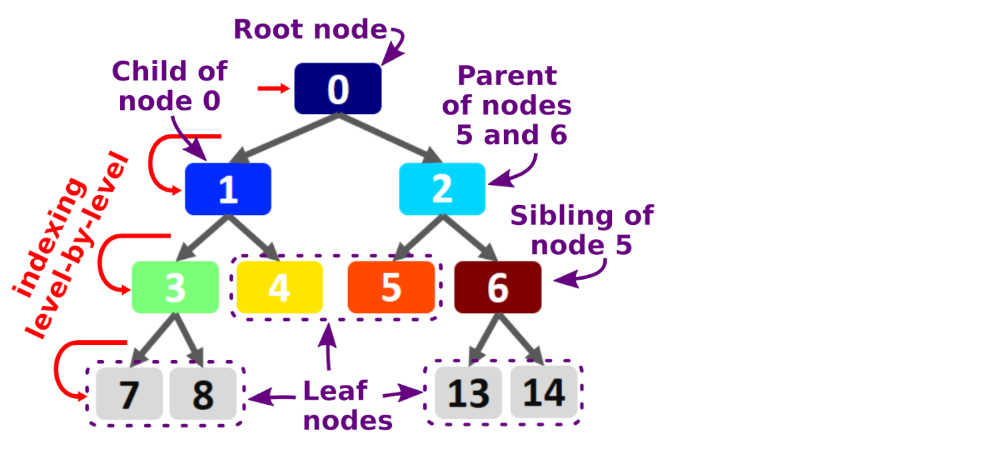

# peakTree

[](https://doi.org/10.5281/zenodo.2577387)

Software for converting multi-peaked (cloud) radar Doppler spectra into a binary tree structure.

Technical documentation is available at [peakTree-doc](https://martin-rdz.github.io/peakTree-doc/)

See also 
Radenz, M., Bühl, J., Seifert, P., Griesche, H., and Engelmann, R.: peakTree: a framework for structure-preserving radar Doppler spectra analysis, Atmos. Meas. Tech., 12, 4813–4828, [https://doi.org/10.5194/amt-12-4813-2019](https://doi.org/10.5194/amt-12-4813-2019), 2019.


### Requirements

peakTree requires python3 with following packages:
```python
numpy==1.14.5
graphviz==0.8.2
matplotlib==2.2.2
netCDF4==1.4.2
numba==0.37.0
toml
```

### Setup

The peakTree software package should be included in a file structure similar to this example:
```
├── data                    [input spectra]
├── docs                    [code to generate the documentation using sphinx]
│   ├── Makefile
│   └── source
├── output                  [converted data]
├── peakTree
│   ├── helpers.py
│   ├── __init__.py
│   ├── print_tree.py
│   ├── test_peakTree.py
│   └── VIS_Colormaps.py
├── plot2d.py
├── convert_to_json.py
├── plots                   [standard folder for plots]
├── reader_example.py
├── README.md
├── instrument_config.toml  [radar specific configuration]
├── output_meta.toml        [add your meta information here]
├── requirements.txt
├── run_conversion.py
├── run_plots.sh
├── run_doc_and_tests.sh
└── spectrum_example.py
```

Please update your meta information in the `output_meta.toml` file.

### Usage

#### 1. Define the peakfinding paramters 

**WIP:** The peakfinding parameters are now compatible with the output of peako [[Kalesse et al. 2019 AMT]](https://doi.org/10.5194/amt-12-4591-2019).
They have to be configured in the `instrument_config.toml` together with some instrument specific meta data.
The parameters are chirp aware.

```
[limrad_punta.settings.peak_finding_params.chirp2]
    t_avg = 15           # s
    h_avg = 0            # m
    span = 0.2           # m s-1
    smooth_polyorder = 1
    prom_thres = 0.5     # dB
    width_thres = 0      # m s-1
```

#### 2. Convert a spectra file to peakTree netcdf output
```python
#! /usr/bin/env python3
# coding=utf-8

import datetime
import peakTree
import peakTree.helpers as h

pTB = peakTree.peakTreeBuffer()
pTB = peakTree.peakTreeBuffer(system='Polarstern')
pTB.load_spec_file('data/D20170629_T0830_0945_Pol_zspc2nc_v1_02_standard.nc4')
pTB.assemble_time_height('output/')
```

#### 3. Plot a peakTree netcdf file
A default plotting script is also included.
```
python3 plot2d.py output/20170629_0830_Pol_peakTree.nc4 --range-interval 400,5000 --no-nodes 2
# or with more options
python3 plot2d.py output/20181216_1510_Pun_peakTree.nc4  --no-nodes 2 --plotsubfolder peaktree_limrad --system limrad_peako --range-interval min,3000
#
python3 plot2d.py output/20190911_0300_Pun_rpgpy_peakTree.nc4 --range-interval 100,7000 --no-nodes 6 --system limrad_punta --plotsubfolder peaktree_limrad_punta
```

convert a peakTree netcdf file to dictionary format
```
python3 convert_to_json.py output/20170629_0830_Pol_peakTree.nc4 output/20170629_0830_data \
 --time-interval 0-450 --range-interval 0-100
```

### Binary tree structure




### License
Copyright 2022, Martin Radenz, Teresa Vogl
[MIT License](<http://www.opensource.org/licenses/mit-license.php>)
