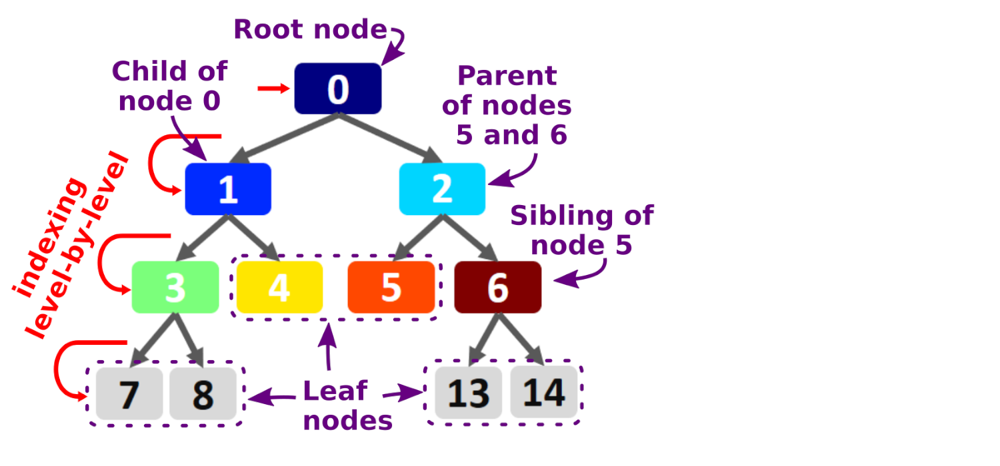

# peakTree

[](https://doi.org/10.5281/zenodo.2577387)

Software for converting multi-peaked (cloud) radar Doppler spectra into a binary tree structure.

> [!IMPORTANT]
> At the moment a refactoring is ongoing, aiming for a more flexible structure and utilizing xarray for generic data handling. The original version is still available [peakTree_legacy](https://github.com/martin-rdz/peakTree_legacy)

Technical documentation is available at [peakTree-doc](https://martin-rdz.github.io/peakTree-doc/)

## Binary tree structure



## Usage


### Atomic functions

```python
ds_example = xr.open_dataset('single_example_spectrum.nc')

>>> <xarray.Dataset> Size: 6kB
>>> Dimensions:  (doppler: 512)
>>> Coordinates:
>>>   * doppler  (doppler) float32 2kB -10.52 -10.47 -10.43 ... 10.47 10.52 10.56
>>>     range    float32 4B 1.465e+03
>>>     time     datetime64[us] 8B 2023-12-28T09:00:32.200000
>>> Data variables:
>>>     Z        (doppler) float32 2kB 3.595e-06 3.595e-06 ... 3.595e-06 3.595e-06
>>>     Zcx      (doppler) float32 2kB 3.152e-06 3.152e-06 ... 3.152e-06 3.152e-06
>>>     noise    float32 4B 2.353e-06
```

First, the binary tree is generated:

```python
vel_step = (ds_example['doppler'][1] - ds_example['doppler'][0]).values
tree = peakTree.generate_tree.spectrum_to_tree(
    vel_step,                                                # Velocity resolution
    ds_example['Z'].values,                                  # Spectral reflectivity (linear units, 1D numpy array)
    ds_example['Z'].values < ds_example['noise'].values*1.3, # Mask for noise floor
    {'width_thres': 0.1, 'prom_thres': 1}                    # Peak finding parameters
)

>>> {0: {'coords': [0],
>>>   'bounds_left': 227,
>>>   'bounds_right': 267,
>>>   'thres': np.float32(3.311432e-06),
>>>   'parent_id': -1},
>>>  1: {'coords': [0, 0],
>>>   'bounds_left': 227,
>>>   'bounds_right': np.int64(247),
>>>   'thres': np.float32(3.5196229e-06),
>>>   'parent_id': 0},
>>>  2: {'coords': [0, 1],
>>>   'bounds_left': np.int64(247),
>>>   'bounds_right': 267,
>>>   'thres': np.float32(3.5196229e-06),
>>>   'parent_id': 0}}
```

The moments for the single moments can be added into the tree:

```python
ds_example_array = ds_example.to_array(dim="inputvar")

tree = peakTree.generate_tree.add_moments(
    tree,
    ds_example['doppler'].values,
    ds_example_array.values,
    ds_example_array.coords["inputvar"].values,
    {'Z': ['M0', 'M1', 'M2', 'M3', 'P']},
)

>>> {0: {'coords': [0],
>>>   'bounds_left': 227,
>>>   'bounds_right': 267,
>>>   'thres': np.float32(3.311432e-06),
>>>   'id_parent': -1,
>>>   'moments': {'Z': {'M0': np.float32(0.014677452),
>>>     'M1': np.float32(-0.6109322),
>>>     'M2': np.float32(0.2462034),
>>>     'M3': np.float32(1.9973509),
>>>     'P': np.float32(890.377)}}},
>>>  1: {'coords': [0, 0],
>>>   'bounds_left': 227,
>>>   'bounds_right': np.int64(247),
>>>   'thres': np.float32(3.5196229e-06),
>>>   'id_parent': 0,
>>>   'moments': {'Z': {'M0': np.float32(0.012891835),
>>>     'M1': np.float32(-0.69831896),
>>>     'M2': np.float32(0.07468125),
>>>     'M3': np.float32(-0.16253266),
>>>     'P': np.float32(837.7099)}}},
>>> ...
```

In preparation of processing larger chunks of data, these functions are combined into a wrapper, which returns an array instead of the pure python dictionary tree

```python
peakTree.generate_tree.ufunc_wrapper(
    ds_example['doppler'].values,
    ds_example_array.coords["inputvar"].values,
    ds_example_array.values,
    (ds_example['Z'] < ds_example['noise']*1.3).values,
    var_peak='Z',
    vel_step=vel_step,
    params={'width_thres': 0.1, 'prom_thres': 1},
    meta={
        'Z': ['M0', 'M1', 'M2', 'M3', 'P'],
        'Zcx': ['M0', 'P'],
        }
)
```


### Processing larger datasets

A convenience function exists to process large datasets:
```python
ds_input['noise_mask'] = ds_input['Z'] < ds_input['noise']*1.3
ds_input = ds_input.drop_vars('noise')

meta={
    'Z': ['M0', 'M1', 'M2', 'M3', 'P'],
    'Zcx': ['M0', 'P'],
    }

ds_rect = peakTree.ds_to_tree(
    ds_input,
    {'width_thres': 0.1, 'prom_thres': 1},
    meta
)

dt = ds_rect.time.values[0].astype('datetime64[us]').astype('O')
ds_rect.to_netcdf(
    path=f'{dt:%Y%m%d_%H%M}_mira_peakTree.nc4'
)
```


### Setup

The peakTree software package should be included in a file structure similar to this example:
```
├── data                    [input spectra]
├── docs                    [code to generate the documentation using sphinx]
│   ├── Makefile
│   └── source
├── output                  [converted data]
├── peakTree
│   ├── helpers.py
│   ├── __init__.py
│   ├── print_tree.py
│   ├── test_peakTree.py
│   └── VIS_Colormaps.py
├── plot2d.py
├── convert_to_json.py
├── plots                   [standard folder for plots]
├── reader_example.py
├── README.md
├── instrument_config.toml  [radar specific configuration]
├── output_meta.toml        [add your meta information here]
├── requirements.txt
├── run_conversion.py
├── run_plots.sh
├── run_doc_and_tests.sh
└── spectrum_example.py
```

Please update your meta information in the `output_meta.toml` file.

### Usage

#### 1. Define the peakfinding paramters 

**WIP:** The peakfinding parameters are now compatible with the output of peako [[Kalesse et al. 2019 AMT]](https://doi.org/10.5194/amt-12-4591-2019).
They have to be configured in the `instrument_config.toml` together with some instrument specific meta data.
The parameters are chirp aware.

```
[limrad_punta.settings.peak_finding_params.chirp2]
    t_avg = 15           # s
    h_avg = 0            # m
    span = 0.2           # m s-1
    smooth_polyorder = 1
    prom_thres = 0.5     # dB
    width_thres = 0      # m s-1
```

#### 2. Convert a spectra file to peakTree netcdf output
```python
#! /usr/bin/env python3
# coding=utf-8

import datetime
import peakTree
import peakTree.helpers as h

pTB = peakTree.peakTreeBuffer()
pTB = peakTree.peakTreeBuffer(system='Polarstern')
pTB.load_spec_file('data/D20170629_T0830_0945_Pol_zspc2nc_v1_02_standard.nc4')
pTB.assemble_time_height('output/')
```

#### 3. Plot a peakTree netcdf file
A default plotting script is also included.
```
python3 plot2d.py output/20170629_0830_Pol_peakTree.nc4 --range-interval 400,5000 --no-nodes 2
# or with more options
python3 plot2d.py output/20181216_1510_Pun_peakTree.nc4  --no-nodes 2 --plotsubfolder peaktree_limrad --system limrad_peako --range-interval min,3000
#
python3 plot2d.py output/20190911_0300_Pun_rpgpy_peakTree.nc4 --range-interval 100,7000 --no-nodes 6 --system limrad_punta --plotsubfolder peaktree_limrad_punta
```

convert a peakTree netcdf file to dictionary format
```
python3 convert_to_json.py output/20170629_0830_Pol_peakTree.nc4 output/20170629_0830_data \
 --time-interval 0-450 --range-interval 0-100
```


### Literature

Radenz, M., Bühl, J., Seifert, P., Griesche, H., and Engelmann, R.: peakTree: a framework for structure-preserving radar Doppler spectra analysis, Atmos. Meas. Tech., 12, 4813–4828, [https://doi.org/10.5194/amt-12-4813-2019](https://doi.org/10.5194/amt-12-4813-2019), 2019.

Vogl, T., Radenz, M., Ramelli, F., Gierens, R., and Kalesse-Los, H.: PEAKO and peakTree: tools for detecting and interpreting peaks in cloud radar Doppler spectra – capabilities and limitations, Atmos. Meas. Tech., 17, 6547–6568, [https://doi.org/10.5194/amt-17-6547-2024](https://doi.org/10.5194/amt-17-6547-2024), 2024. 

### License
Copyright 2026, Martin Radenz, Teresa Vogl
[MIT License](<http://www.opensource.org/licenses/mit-license.php>)
