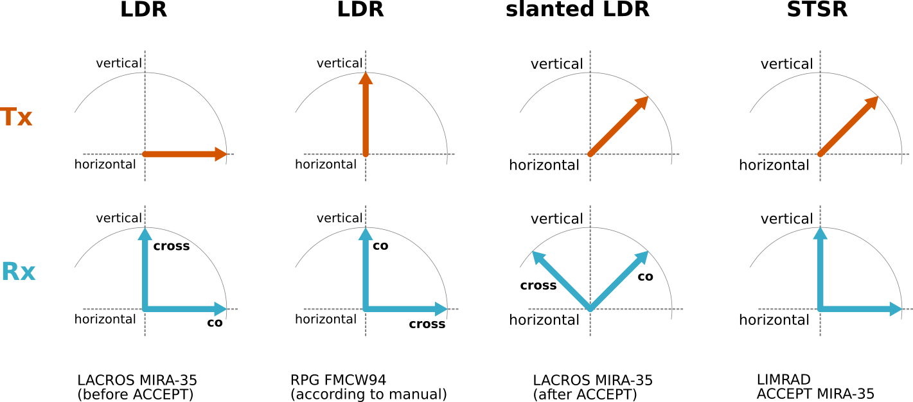
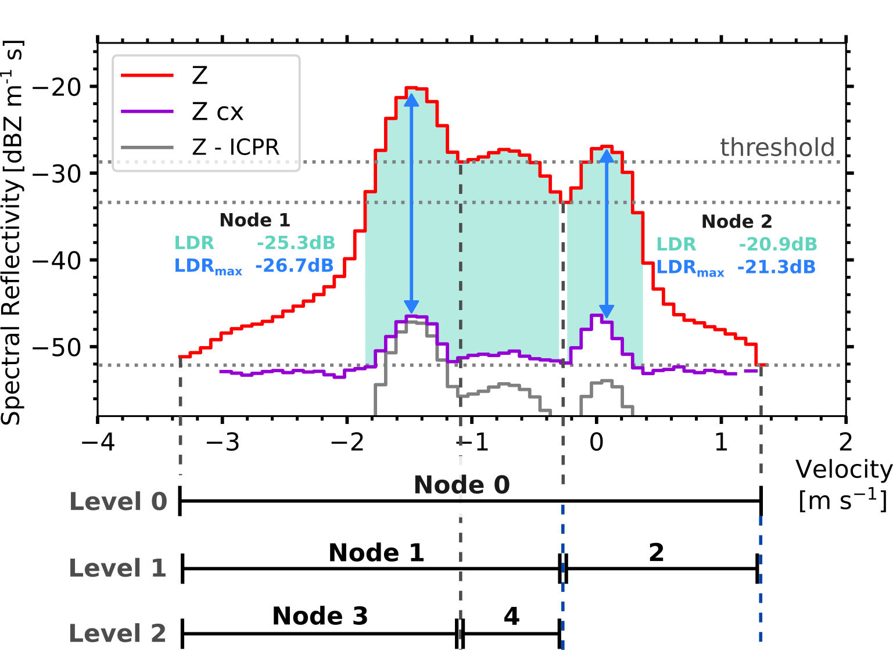

====================
Polarimetry
====================

Spectral polarimetric variables can be calculated for two configurations: ``STSR`` and ``LDR``.

   Scheme of the polarimetric configurations. 

LDR mode
---------

With this configuration, the LDR can be calculated directly

.. math::
    
    \mathrm{LDR} = \frac{<E_\mathrm{x}^2>}{<E_\mathrm{c}^2>}

..
    describe filtering

LDR and LDRmax
----------------

The polarimetric properties are calculated as a peak average (with filtering of cross-channel noise and decoupling) as well as at the maximum of the co-channel reflectivity (ignoring cross-channel noise level and decoupling).

   Illustration of LDR and LDRmax. 

STSR mode
----------

A radar in STSR mode configuration transmits and receives the signal Simultaneous in the V and H channel. The co- and cross channel signal have to be calculated [Myagkov_et_al_2016]_.
In the files provided for the RPG FMCW the total spectra are saved in the ``VSpec`` variable, :math:`(H + V + 2 \,\operatorname{\mathbb{R}e} \{\mathrm{Cov}\})/4`, while the H spectrum is given as it is.

- (re-)calculate the V spec
- calculate spectral rhv
- calculate the LDR 

With the STSR configuration, the LDR cannot be observed directly, but has to be calculated from the correlation coefficient.
Following the assumption of isotropic scatterers [Galletti_Zrnic_2012]_ and reflection symmetry [Galletti_et_al_2011]_, as done in `rpgpy`_ ``calc_spectral_LDR()``:

.. math::

    \mathrm{SLDR} = 10 \log_{10} \left( \frac{1-\varrho_\mathrm{hv}}{1+\varrho_\mathrm{hv}} \right)

With  :math:`\varrho_\mathrm{hv} = \varrho_s` for vertical looking observations (Eq. 12 [Galletti_Zrnic_2012]_). 

Alternatively, there is also an alternative approach by Myagkov [Myagkov_pers_comm]_:

.. math::

    \mathrm{SLDR} &= 10 \log_{10} \left( \frac{Z_\mathrm{cx}}{Z_\mathrm{co}} \right) \\
    Z_\mathrm{cx} &= \left( Z_\mathrm{h} + Z_\mathrm{v} \right) \left(1 - \varrho_s \right) \\
    Z_\mathrm{co} &= \left( Z_\mathrm{h} + Z_\mathrm{v} \right) \left(1 + \varrho_s \right)

where low signals in the cross-channel can be more easily filtered.

.. [Galletti_et_al_2011] Galletti, M., Zrnic, D.S., Melnikov, V.M., Doviak, R.J., 2011. Degree of polarization: theory and applications for weather radar at LDR mode, in: 2011 IEEE RadarCon (RADAR). Presented at the 2011 IEEE Radar Conference (RadarCon), IEEE, Kansas City, MO, USA, pp. 039–044. https://doi.org/10.1109/RADAR.2011.5960495

.. [Galletti_Zrnic_2012] Galletti, M., Zrnic, D.S., 2012. Degree of Polarization at Simultaneous Transmit: Theoretical Aspects. IEEE Geosci. Remote Sensing Lett. 9, 383–387. https://doi.org/10.1109/LGRS.2011.2170150

.. [Myagkov_et_al_2016] Myagkov, A., Seifert, P., Bauer-Pfundstein, M., and Wandinger, U., 2016. Cloud radar with hybrid mode towards estimation of shape and orientation of ice crystals, Atmos. Meas. Tech., 9, 469–489, https://doi.org/10.5194/amt-9-469-2016

.. [Myagkov_pers_comm] personal communication

.. _rpgpy: https://github.com/actris-cloudnet/rpgpy/blob/master/rpgpy/spcutil.py